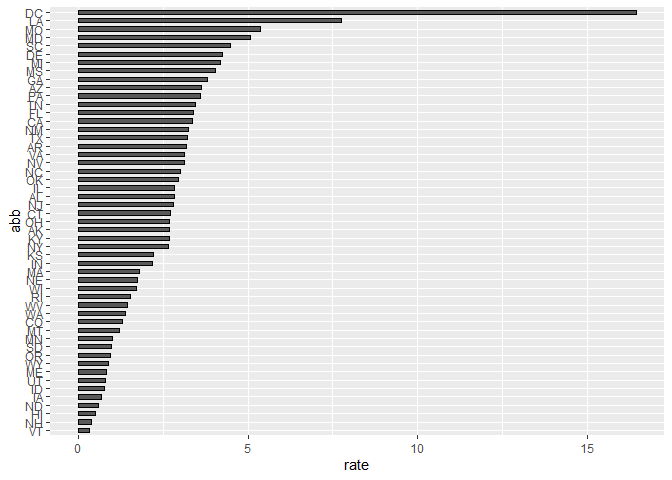

AnaisysReport
================
Marco Forgia
31/03/2020

## Introduction

Analysis about the 2010 gun murders in USA, already wrangled data are
available in this directory

``` r
load("rda/murders.rda")
```

the analysis was conducted using this library:

``` r
library(tidyverse)
```

and complete information about the analysis could be found in the
README.txt file.

## Murder rate by state

the analysis shows great variability in the gun murder rate from state
to state <!-- -->
